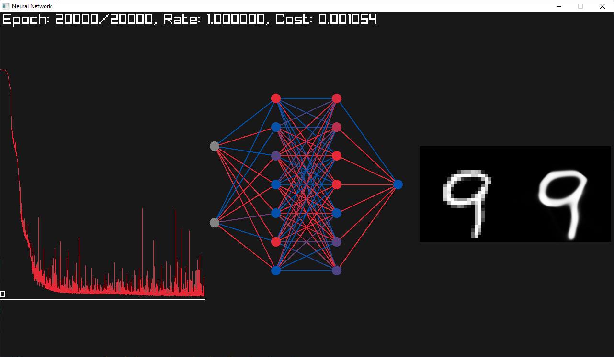
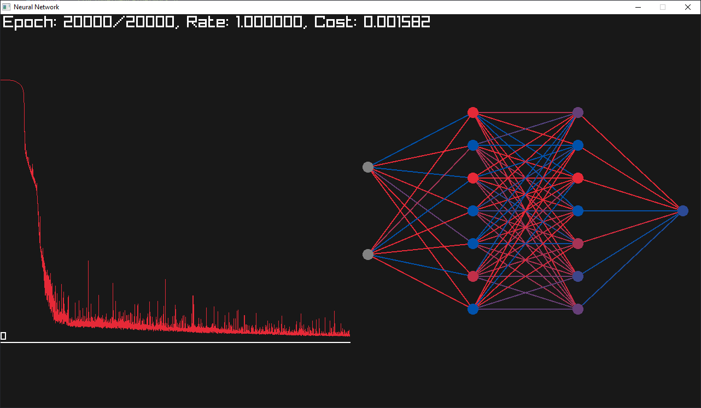

# NeuralNetworkCpp

## Quick Start

### Run
If the files aren't already built, this will build them as well.
```console
$ make run
```

### Build
Builds the specified file in the build directory.
```console
$ make build
```
### Build_All
Builds all files in the build directory.
```console
$ make build_all
```

### Clean
Removes all files in the build directory.
```console
$ make clean
```


## Demos

### Transition
https://github.com/crismariudenis/NeuralNetworkCpp/assets/78813212/89fe7598-73ad-416c-ac12-94ff1306462c


### Upscale 


### DigitLearn

```console


                                            76  160 166 166 204 191 166 33
                                    117 242 254 254 254 254 206 215 254 247 128
                                70  248 254 198 64  27  27  6   10  27  168 245 129
                            6   195 253 128 15                          10  236 189
                            146 254 166                                 115 212 8
                            215 246 41                              63  252 201
                            215 232                             34  228 254 139
                            215 246 68                      94  227 254 212 10
                            194 254 248 176 148 148 148 222 251 254 254 135
                            16  176 254 254 254 254 254 233 140 217 254 51
                                4   76  75  133 114 44  24      184 254 9
                                                                184 254 47
                                                                184 254 98
                                                                184 254 98
                                                                184 254 75
                                                                184 254 9
                                                            16  245 213 4
                                                            60  254 174
                                                            108 254 102
                                                            108 218


                                                    1   1   1   1   1   1
                                                    1   1   1   1   1   1
                                                    1   1   1   1   1   1
                                                    1   1   1   1   1
                                                1   1   1   1   1   1
                                                1   1   2   2   2   1
                                            1   3   5   6   7   6   4   1
                                        7   86  159 183 190 189 181 149 37
                                    143 247 247 244 240 236 231 229 234 239 149
                                101 246 241 178 85  42  26  18  16  26  150 227 134 1
                            6   233 238 106 12  5   4   3   3   3   4   29  233 176 2
                            115 240 183 5   2   2   2   3   3   3   4   113 247 25
                        4   205 241 45  1   1   2   2   3   3   4   17  251 229
                        15  226 233 16      1   2   3   4   6   22  238 252 12
                    1   22  225 230 48  2   3   5   8   18  86  235 253 227 2
                    1   11  190 241 230 194 151 125 174 223 241 250 252 102 1
                        1   19  177 248 254 254 250 233 197 194 238 251 46  1
                            1   7   39  150 189 85  31  22  46  199 250 38
                        1   1                   4   3   4   14  166 251 44
                                                1   1   2   10  167 251 52
                                                    1   2   10  195 250 50
                                                    1   2   14  224 249 38  1
                                                        2   24  240 244 25  1
                                                        2   44  247 225 15  2
                                                        2   80  248 165 9   2   1
                                                            112 241 66  5   2   1   1
                                                            67  161 14  3   2   1   1   1
                                                            2   8   2   2   1   1   1   1   1   1
=======
      


                                                                    1
            1   1                                               2   2
                1   1   1                               1   7   13  6
                    1   1   1   1   1   8   62  164 190 187 192 195 139 22  1
                                5   124 249 251 241 217 198 207 231 242 240 195 3
                                74  252 253 216 57  14  7   8   16  65  212 242 77  1
                            2   226 248 125 2                           38  182 67  15  8   4   1
                            132 244 177 3                           1   77  161 42  17  15  10  4
                        12  238 240 63                          2   45  226 150 6   1   1   1   1
                        30  234 224 37              1   5   22  76  220 249 68
                        4   194 221 84  12  9   21  53  98  134 186 248 248 8
                            134 233 198 136 132 155 171 171 162 199 249 229
                            54  208 213 203 201 196 178 140 106 170 246 145
                            3   21  76  141 165 150 102 50  33  131 238 49
                                        11  39  38  19  7   9   126 230 15
                                            1   2   1   1   5   162 225 6
                                                            6   209 221 2
                                                            14  235 216 1
                                                            40  244 206
                                                            86  247 188
                                                            109 246 157
                                                            70  238 106
                                                            11  192 46
                                                                43  9
>>>>>>> f1e8a20bba7430d521c494966f2127ced4845860
```

### Adder

```console
1 + 3 = 4.00486
6 + 4 = 10.0266
1 + 4 = 5.00045
6 + 6 = 12.0141
2 + 0 = 2.03343
1 + 1 = 2.03916
1 + 3 = 4.00486
1 + 3 = 4.00486
3 + 6 = 9.0138
3 + 4 = 6.9895
7 + 4 = 10.9675
6 + 1 = 7.0752
4 + 6 = 10.0099
5 + 4 = 9.01112
6 + 7 = 13.001
7 + 6 = 12.9788
3 + 2 = 5.03603
5 + 0 = 5.06653
3 + 3 = 5.98779
3 + 6 = 9.0138
```

### Xor

```console
1.000000 ^ 1.000000 = 0.007053
1.000000 ^ 0.000000 = 0.993426
0.000000 ^ 1.000000 = 0.993421
0.000000 ^ 0.000000 = 0.007556
```
